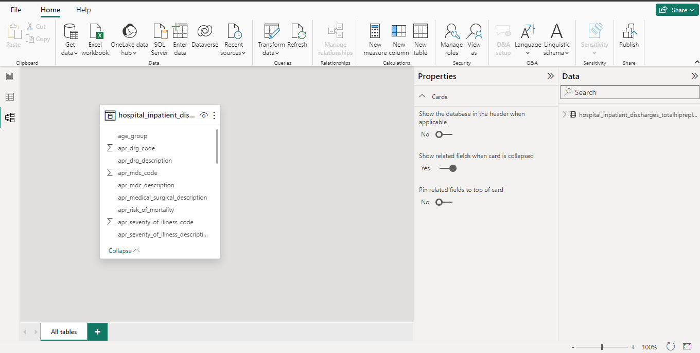

# Analyzing-Healthcare-Data-in-PowerBI
In healthcare, improving efficiency while maintaining high-quality patient care is a top priority. In this PowerBI Case study, I explored a real-world dataset to uncover hospital efficiency insights, I analyzed attributes impacting the patient's length of stay (LOS) and cost and worked to identify factors contributing to hospital differences. 

I leveraged my DAX skills to create measures and generate insightful visualizations. To finish off, I brought it all together in a sophisticated business dashboard to communicate insights to the team. 

This case study gave me a chance to practice a range of Power BI skills, working with real-world data.  

Enough with the chitchat let's dive in!

# The Problem
In this case study, a fictitious consulting company called HealthStat has hired me to uncover insights on potential hospital efficiency opportunities, and they would like me to analyze a state-wide hospital dataset and leverage my Power BI skills to create an engaging dashboard of insights.

# Dataset & Data Model
The dataset was provided by Healthstat. They've captured patient-level data on all hospital stays in a single year for elective hip replacement surgeries across the state of New York.

The dataset is one single table with 30 columns Each row in the dataset represents a single inpatient stay, from their admission to discharge date. The health information in this dataset is not individually identifiable. This means the file does not contain personal health information.

The dataset has some key attributes to analyze efficiency. Length of stay measured in total days and Total costs attributed to each hospital stay.

Here's a list of some of the key attributes of interest for the case study:

facility_id, 

age_group, 

patient disposition, 

diagnosis description, 

severity of illness, and risk of mortality. 

We will closely evaluate these (and others) in the case study as we work to understand what factors impact the length of stay and related costs.

# Case Study Details
In healthcare analytics, there are several quality metrics to be considered but for this case study, I'll focus on efficiency, which is all about avoiding waste. This includes minimizing waste of equipment, supplies, ideas and energy.

Length of stay (or LOS) is considered an important indicator of the efficiency of hospital management. It's calculated as the total duration in days of a patient's stay in a hospital. A shorter LOS is often desirable in hospital operations. Although, many factors can impact LOS. Patient age, health status, the type of procedure (or surgery), whether or not there were any complications, and the size of the hospital are some common factors.

Here are some terms you will encounter throughout this case study: 

An inpatient: is a person who has been admitted to a hospital bed. 

A discharge: is defined as the release of a patient from hospital care by a medical worker. 

Disposition: This is the patient destination or status upon discharge, for instance to another facility or home. 

An elective surgery: is a procedure that was planned, in other words, it was not due to an emergency.

In this case study, the focus is on patients who received hip replacement surgery. Here's a bit of a background on what this procedure is all about. Patients with hip pain, typically arthritis, may require elective hip replacement surgery. In this procedure, damaged bone and cartilage are surgically removed and replaced with prosthetic components. 

Hospital stays can range from 0 to 2 or more days.

#  Exploratory Analysis Of The Dataset

I loaded the data into the PowerQuery editor to investigate it for errors and performed some exploratory analysis. I removed all the rows of data where the description was not "HIP REPLACEMENT, TOT/PRT" and I created a _Measures table to host my measures. I then created a measure called "Total Hospitals" to show the Distinct count of hospitals.

To build an understanding of patient profiles in the dataset I explored the preliminary demographics such as gender and age and created a measure "Total Discharges" to count total discharges in the dataset and stored it in the _Measures table. 

HealthStat assigned a clinical advisor to direct me in some of my tasks, this is to help guide my analysis from a clinical perspective, the clinical advisor requested to see a breakdown for patients aged 50 and older. I modified my visualization of gender distribution by age group to account for this change.

After establishing some key information about total hospitals and discharges in the dataset along with some interesting demographics on the patient profile. It was time to explore how length of stay (LOS) days varied across the demographic fields. I created a measure (Average LOS Days) to calculate the average length of stay days and stored the measure in the _Measures table.

I created two visualizations to show the average LOS days by age group and gender, again I filtered to assess patients aged 50 or older. To do this I created a new column called "Age Band" and assigned a value of "Age 50+" if age 50+ and "Age <50" if not. I replaced the age_group with this new field.

The leadership team at HealthStat want to see how average LOS days and total discharges compare between hospitals. The clinical advisor also added for me to factor in the total number of practising surgeons by the hospital.

I created a line and stacked column chart to visualize both the total discharges and the average LOS days by hospital

